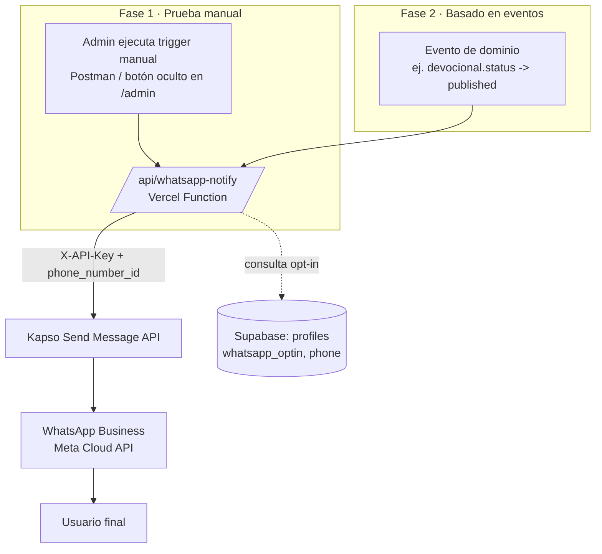

# SDD-03: Integración Kapso (WhatsApp Business)

## 1. Nombre y Owner del módulo
- **Módulo**: Integración con Kapso para envío de mensajes WhatsApp Business
- **Owner**: Patricio (implementación) / Álvaro (producto y credenciales Kapso)

## 2. Contexto y motivación
Ya contamos con una cuenta de WhatsApp Business en **Kapso**. El objetivo es conectar esa cuenta con `ibvn-app` para poder notificar por WhatsApp a los miembros que hicieron opt-in (`profiles.whatsapp_optin`), reemplazando el placeholder actual de la sección "Notificaciones" (hoy sin funcionalidad real, ver `src/pages/Notificaciones.jsx`).

El backlog (`mejoras-mvp.md`, backend #3) ya contemplaba "Crear eventos en la aplicación que permitan enviar notificaciones", y `SDD-02` ya anticipaba un "trigger de N8N" posterior a la publicación de un devocional. Es decir, el envío por eventos **no es una idea nueva**, sino un paso pendiente del roadmap que ahora se destraba gracias a tener la cuenta Kapso lista.

Se propone un enfoque en dos fases:
1. **Fase 1 (ahora)**: probar que desde la app se puede gatillar manualmente un mensaje de WhatsApp vía Kapso, para validar credenciales, formato y ventana de envío.
2. **Fase 2 (siguiente)**: conectar ese mismo mecanismo a eventos reales de la app (ej. publicación de devocional, futura tabla de "eventos" de iglesia).

## 2.1 Estado actual relevado (auditoría del repo)
Antes de diseñar, se revisó si ya existían "eventos" configurados en la app. Hallazgos:

| Elemento | Estado actual | Campos |
| :--- | :--- | :--- |
| `profiles.whatsapp_optin` / `whatsapp_optin_date` | ✅ Existe (migración MVP5) | `boolean`, `timestamptz` |
| `profiles.phone` (o similar) | ❌ **No existe** en ningún schema/migración | — |
| Tabla de "eventos de iglesia" (backend #3 del backlog) | ❌ No implementada aún | — |
| `src/pages/Notificaciones.jsx` | Placeholder estático, sin lógica ("próximamente") | — |
| `src/pages/Calendario.jsx` | Solo embebe un iframe de Google Calendar (`churchSettings.calendar_url`); no es una tabla ni genera eventos de dominio | — |
| `src/lib/analytics.js` (`trackEvent`) | Eventos de **PostHog** (analítica de producto), no conectados a WhatsApp ni al backend | `eventName: string`, `properties: object` |
| `devocionales.status` (SDD-02) | Existe (`draft` \| `published` \| `archived`) — es el candidato más natural para el primer evento real | — |
| Variables de entorno Kapso (`.env.example`) | ❌ No configuradas | — |

**Conclusión**: no hay ningún sistema de eventos de negocio conectado a notificaciones todavía. Lo más cercano es el campo `devocionales.status`, y falta un campo de teléfono en `profiles` — es un bloqueante para poder direccionar cualquier mensaje.

## 3. Requerimientos Funcionales Priorizados (MoSCoW)

### Must Have
- Agregar credenciales de Kapso (`KAPSO_API_KEY`, `KAPSO_PHONE_NUMBER_ID`) como variables de entorno server-side (Vercel), nunca expuestas al frontend (`VITE_*`).
- Endpoint serverless (`/api/whatsapp-notify`) que reciba `{ to, message }` y llame a la API de envío de Kapso.
- Prueba manual: gatillar un mensaje de WhatsApp de prueba hacia un número fijo (ej. el de Patricio o Álvaro) desde Postman/curl o un botón oculto en `/admin`, sin depender de ningún evento real.
- Agregar columna `phone` (E.164) a `profiles`, si no se hace ya como parte del backend #2 del backlog.
- Validar `whatsapp_optin = true` antes de enviar cualquier mensaje a un usuario.

### Should Have
- Conectar el endpoint a un evento real de la app: al pasar `devocionales.status` a `published`, notificar a todos los `profiles` con `whatsapp_optin = true`.
- Logging de envíos (éxito/error) para poder auditar quién recibió qué y cuándo.

### Could Have
- Orquestar el envío vía N8N (ya usado en el pipeline de devocionales) en lugar de llamar a Kapso directo desde Vercel, para reutilizar la infraestructura de automatización existente.
- Tabla de "eventos de iglesia" (backend #3 del backlog) como segundo disparador, una vez exista esa feature.
- Uso de *message templates* aprobados por Meta para poder notificar fuera de la ventana de 24 horas.

### Won't Have (en esta fase)
- Recepción de mensajes entrantes o webhooks de Kapso hacia la app (conversaciones bidireccionales).
- Un bus de eventos genérico de la aplicación (event bus interno); se conecta directamente el/los eventos puntuales que se necesiten.
- Integración con Kapso Flows/Agents (mensajería conversacional automatizada).

## 4. Requerimientos No Funcionales
- **Seguridad**: `KAPSO_API_KEY` solo en variables de entorno server-side de Vercel; jamás en el bundle del cliente ni en el repo.
- **Consentimiento**: ningún envío debe ignorar `whatsapp_optin`. Es un requisito legal/de confianza con la congregación.
- **Resiliencia**: un error de Kapso (ej. número fuera de la ventana de 24h) no debe romper el flujo principal (ej. publicar un devocional) — debe loguearse y continuar.
- **Costos**: el envío de texto libre (no-template) dentro de la ventana de 24h no tiene costo de plantilla; monitorear si se necesitan templates a futuro (tienen costo/aprobación Meta).

## 5. High Level Solution



**Fase 1**: se gatilla manualmente (sin tocar lógica de negocio) para confirmar que las credenciales, el `phone_number_id` y el formato del payload son correctos.

**Fase 2**: el mismo endpoint se invoca automáticamente desde el punto de la app donde ocurre el evento (ej. al hacer `UPDATE devocionales SET status = 'published'`), filtrando primero los `profiles` con opt-in activo.

## 6. Low Level Solution

### Variables de entorno nuevas (`.env.example`)
```env
# --- KAPSO (WhatsApp Business) ---
KAPSO_API_KEY=""
KAPSO_PHONE_NUMBER_ID=""
```

### Endpoint `/api/whatsapp-notify.js` (mismo patrón que `api/process-audio.js`)
```js
// api/whatsapp-notify.js
export default async function handler(req, res) {
  if (req.method !== 'POST') {
    return res.status(405).json({ error: 'Method not allowed' });
  }

  const { to, message } = req.body; // to: E.164, ej. "56912345678"
  if (!to || !message) {
    return res.status(400).json({ error: 'to y message son requeridos' });
  }

  const phoneNumberId = process.env.KAPSO_PHONE_NUMBER_ID;
  const response = await fetch(
    `https://api.kapso.ai/meta/whatsapp/v24.0/${phoneNumberId}/messages`,
    {
      method: 'POST',
      headers: {
        'Content-Type': 'application/json',
        'X-API-Key': process.env.KAPSO_API_KEY,
      },
      body: JSON.stringify({
        messaging_product: 'whatsapp',
        recipient_type: 'individual',
        to,
        type: 'text',
        text: { body: message },
      }),
    }
  );

  const data = await response.json();
  if (!response.ok) {
    return res.status(response.status).json({ error: data });
  }
  return res.status(200).json({ status: 'OK', code: 200, data });
}
```

### Prueba manual (Fase 1)
```bash
curl -X POST https://<tu-deploy>.vercel.app/api/whatsapp-notify \
  -H "Content-Type: application/json" \
  -d '{"to":"56912345678","message":"Prueba de integración Kapso desde ibvn-app 🎉"}'
```

### Esquema de Base de Datos (cambios)
```sql
-- Requiere backend #2 del backlog (teléfono obligatorio)
ALTER TABLE public.profiles
  ADD COLUMN IF NOT EXISTS phone text; -- formato E.164, ej. +56912345678
```

### Fase 2 — disparo desde evento de devocional publicado
Pseudocódigo del punto de integración (en el flujo de publicación existente de SDD-02):
```js
if (newStatus === 'published') {
  const { data: subscribers } = await supabase
    .from('profiles')
    .select('phone')
    .eq('whatsapp_optin', true)
    .not('phone', 'is', null);

  for (const { phone } of subscribers) {
    await fetch('/api/whatsapp-notify', {
      method: 'POST',
      body: JSON.stringify({ to: phone, message: '📖 Nuevo devocional disponible hoy.' }),
    });
  }
}
```
> Nota: para volumes mayores, reemplazar el loop por batch/cola (o mover esta orquestación a N8N, que ya es parte del pipeline de devocionales).

### APIs Externas Requeridas
- `KAPSO_API_KEY`: Project API Key (Kapso Dashboard → Project Settings → API Keys).
- `KAPSO_PHONE_NUMBER_ID`: ID del número de WhatsApp Business conectado (Kapso Dashboard → WhatsApp Numbers).
- Endpoint: `POST https://api.kapso.ai/meta/whatsapp/v24.0/{phone_number_id}/messages`.

## 7. Fuera de Scope (Explícito)
- Webhooks entrantes de Kapso hacia `ibvn-app` (respuestas de usuarios, estados de entrega/lectura).
- Uso de Kapso Flows/Agents para conversaciones automatizadas.
- Sistema genérico de "eventos de iglesia" (backend #3 del backlog) — se conecta cuando exista.
- Envío vía *message templates* aprobados (se evalúa solo si el envío fuera de la ventana de 24h se vuelve necesario).

## 8. Criterios de Aceptación
- Con `KAPSO_API_KEY` y `KAPSO_PHONE_NUMBER_ID` configurados en Vercel, un `curl`/Postman al endpoint `/api/whatsapp-notify` entrega un mensaje real al número de prueba.
- El endpoint responde `200` con el payload de Kapso en caso de éxito, y un error controlado (no un 500 genérico) si Kapso rechaza el envío (ej. fuera de ventana de 24h, número inválido).
- Ningún mensaje se envía a un `profile` con `whatsapp_optin = false` o `phone = null`.
- La `KAPSO_API_KEY` no aparece en ningún bundle del frontend (verificable inspeccionando el build).
- (Fase 2) Al publicar un devocional, todos los opt-in con teléfono válido reciben el mensaje, y los errores individuales quedan logueados sin detener el resto del envío.

## 9. Riesgos técnicos identificados
- **Falta de campo `phone` en `profiles`**: es un bloqueante real hoy — sin este dato no hay a quién notificar. Depende de que se resuelva el backend #2 del backlog ("Teléfono como campo obligatorio"). *Debe resolverse antes o junto con la Fase 1.*
- **Ventana de 24 horas (Meta)**: fuera de una conversación activa de 24h, solo se pueden enviar *message templates* pre-aprobados por Meta, no texto libre. Si la notificación de devocionales se dispara sin que el usuario haya escrito antes, esto puede bloquear el envío silenciosamente. *Mitigación*: validar en la prueba manual (Fase 1) si el número de prueba está dentro/fuera de ventana, y si es necesario, dar de alta un template en Kapso/Meta antes de la Fase 2.
- **Formato de teléfono**: `phone` debe normalizarse a E.164 (ej. `+56912345678`) al capturarlo en el registro/perfil; de lo contrario Kapso rechazará el envío.
- **Volumen de envío**: enviar en loop secuencial desde una Vercel Function puede toparse con timeout si la lista de opt-in crece. *Mitigación*: mover la orquestación a N8N (ya contemplado en SDD-02) o a un batch/cola cuando el volumen lo justifique.
- **Exposición de credenciales**: si `KAPSO_API_KEY` se agrega por error con prefijo `VITE_`, quedaría expuesta en el bundle público. Debe validarse explícitamente en code review.
