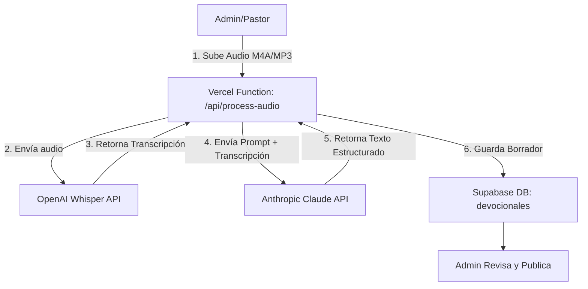

# SDD-02: Devocional Diario y Pipeline IA

## 1. Nombre y Owner del módulo
- **Módulo**: Devocional Diario & Pipeline de Generación con IA
- **Owner**: Patricio / Álvaro (Líderes Técnicos)

## 2. Contexto y motivación
El envío y consumo de devocionales diarios es el feature principal (MVP1) de la Vida Nueva App. Para optimizar el tiempo pastoral, se desea que a partir de un audio grabado (ej. en WhatsApp), un sistema transcriba el mensaje y genere el texto estructurado del devocional. La propuesta simplificada sugiere usar Vercel Functions para conectarse a las APIs de Whisper (OpenAI) y Claude (Anthropic), en lugar de un microservicio separado inicialmente.

## 3. Requerimientos Funcionales Priorizados (MoSCoW)

### Must Have
- Lectura de devocional del día (texto, versículo, reflexión).
- Guardado de reflexiones personales (Journaling) asociados a un devocional.
- Pipeline IA: Recepción de audio y transcripción usando OpenAI Whisper.
- Pipeline IA: Generación de contenido estructurado usando Claude 3.5 Sonnet.
- Guardado de los resultados del Pipeline en Supabase.

### Should Have
- Historial de devocionales (días anteriores).
- Descarga de devocional en PDF.

### Could Have
- Audio player dentro de la app PWA para escuchar el devocional.

### Won't Have (en MVP1/2)
- Microservicio complejo en FastAPI exclusivo para el procesamiento del audio.
- Automatización total sin revisión humana (siempre se debe publicar después de que un Pastor revise).

## 4. Requerimientos No Funcionales
- **Escalabilidad**: El uso de Vercel Functions serverless soporta la baja demanda inicial y scale-to-zero.
- **Costos**: Mantener los costos dentro de los free tiers en Vercel, y pay-per-use directo para Claude/Whisper.
- **Timeout**: El procesamiento del audio puede demorar algunos segundos; Vercel Functions (Pro) soporta hasta 5 mins, pero en Free el límite es 10s-60s. *Esto es un riesgo a considerar (ver sección 9).*

## 5. High Level Solution



## 6. Low Level Solution

### Esquema de Base de Datos
```sql
CREATE TABLE public.devocionales (
  id uuid DEFAULT gen_random_uuid() PRIMARY KEY,
  titulo text NOT NULL,
  versiculo_referencia text,
  versiculo_texto text,
  cuerpo_texto text NOT NULL,
  frase_reflexion text,
  audio_url text,
  status text DEFAULT 'draft' CHECK (status IN ('draft', 'published', 'archived')),
  fecha_publicacion date,
  created_at timestamp with time zone DEFAULT timezone('utc'::text, now()) NOT NULL,
  created_by uuid REFERENCES public.profiles(id)
);

CREATE TABLE public.journal_entries (
  id uuid DEFAULT gen_random_uuid() PRIMARY KEY,
  devocional_id uuid REFERENCES public.devocionales(id),
  user_id uuid REFERENCES public.profiles(id),
  contenido text NOT NULL,
  created_at timestamp with time zone DEFAULT timezone('utc'::text, now()) NOT NULL,
  UNIQUE(devocional_id, user_id)
);
```

### APIs Externas Requeridas
- `OPENAI_API_KEY`: Para el endpoint `v1/audio/transcriptions`.
- `ANTHROPIC_API_KEY`: Para la generación de texto estructurado.

## 7. Fuera de Scope (Explícito)
- Envío automático e irreversible por WhatsApp (la revisión humana es un paso de aprobación mandatorio antes del trigger de N8N).

## 8. Criterios de Aceptación
- El admin puede cargar un audio desde el panel de administración.
- El sistema procesa el audio y genera el texto sin errores (devuelve un status de éxito o fallo controlado).
- El borrador guardado en la DB incluye todas las secciones correctamente separadas.
- Los miembros de la iglesia pueden ver el devocional publicado de hoy.
- Los miembros pueden escribir su journal y nadie más (ni siquiera otros miembros) puede leerlo.

## 9. Riesgos técnicos identificados
- **Timeout de Vercel Functions**: En el plan Vercel Free, el límite de ejecución (timeout) para Serverless Functions varía (ej. 10s en Edge, 10-60s en Node.js según la región). Transcribir y generar texto puede tomar más de 10-15 segundos. 
  - **Mitigación A**: Utilizar Edge Functions si es posible (pero Whisper requiere file upload, Edge no tiene sistema de archivos).
  - **Mitigación B**: Desacoplar la llamada. Subir a Supabase Storage y activar un Webhook asíncrono o usar un sistema de colas simple (Inngest / Upstash).
  - **Mitigación C**: Si el límite de Vercel es un bloqueador real para MVP1, mover este único endpoint a Supabase Edge Functions (timeout de 2s a 150s, configurable hasta 5 minutos usando background invocations). *Recomendado*.
